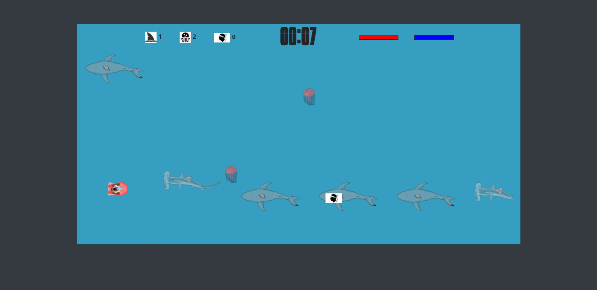

# Hakathon - thème : 'Les vacances d'été'

* ## Introduction
* ## Spécifications techniques
* ## Présentation des jeux
    * ## Mission:Corse
    * ## Breizh-Plage

## Introduction :

### Dans le cadre de ma formation, en fin d'année 2020, peu avant l'examen, nous avons pu, par groupe de 4, nous "évader" quelque peu par ce challenge visant à programmer ce que l'on voulait sur le thème des vacances d'été. Nous laissant un délai d'une semaine.

### Nous nous sommes rapidement entendu sur la programmation de 2 jeux mettant en scène les vacances de notre formateur, traitant ainsi le sujet avec humour. J'ai pu par la même occasion renouer avec mon autre passion, le dessin.

### En plein préparatif des examens, nous nous sommes finalement retrouvé à 2 sur le projet, l'aute moitié de l'équipe trop en retard sur leur projet professionnel à présenté pour l'examen préférant se concentrer la dessus.

### Nous avons tout de même relevé le défi et avons eu le plaisir de le remporté ! :)

### Ce fut en plus d'être une détente importante avant les examens, une vrai course dans laquelle nous avons eu plaisir de collaborer, nous avons pu nous partager les taches, faire appel aux expériences de l'un et l'autre pour avancer et en apprendre plus. Excercice très instructif.

## Spécifications techniques :

### Nos jeux reposent sur l'utilisation de Javascript et principalement son canvas et la méthode setInterval(). L'utilisation du localStorage a permis de communiquer entre les pages pour stocker le pseudo, prévenir la fin du jeu et afficher en conséquence une modale pour un calcul dynamique des scores et définir si le score de la partie intègre ou non le top10. Cette modale est créée en JS en utilisant la méthode document.createDocumentFragment(), améliorant les performances puisque le fragment étant stocké en mémoire et non dans l'arbre DOM, les modifications qui lui sont apportées n'enntraînent pasde calcul de position des éléments de la page.

### Bootstrap nous a permis de gagner du temps pour styliser nos page, compte tenu du délai court du challenge et de notre effectif réduit.

## Présentation des jeux :
* ## Mission:Corse :
### Notre formateur étant corse et fan des missions impossibles, nous avons implémenté un jeu consistant à traverser la mer en jet-ski pour rejoindre la Corse en 45 secondes sur fond de générique de la musique célèbre des films de la franchise. 

### Les touches directionnelles permettant de récupérer des drapeaux Corse ou d'échapper aux requins et méduses. La touche espace permettant de tirer sur ces derniers.

### accueil du joueur par une modale et un texte de mise en situation

### la partie commence

### Si la jauge de vie tombe à 0, une modale annonce le game over

### Si le joueur atteint la corse à la fin du décompte des 45 secondes, redirection vers la page des top10 pour un calcul dynamique des scores en fonction du nombres de requins et méduses tués, drapeaux attrapés et vie restante.

* ## Breizh-Plage :

### Le second jeu prend la direction de la bretagne, ceci étant un clin d'oeil à la région d'origine de l'un de nos collègues de formation.
### Cette fois notre formateur se rend en Bretagne voir ce collègue, il va devoir l'aider en shootant des goélands pour éviter les fientes des volatiles... (Oui on avait 5 jours et ça nous faisait rigoler)

### Le joueur va devoir avec la souris viser les goélands et cliquer pour tirer et avec les touches droite et gauche faire bouger le personnage pour éviter les fientes. Le jeu prend fin si le joueur est touché ou si le tireur à épuisé ses cartouches (elles sont représentées autour de l'écran de jeu et chaque tir fait disparaitre une cartouche)

### L'accueil se fait par une mise situation

### Puis le jeu peut se faire

### Ici pas de game over le jeu prend fin par le calcul des scores, l'intérèt étant cette fois ci un chrono et un gros nombre de goélands abattus pour un score important.

