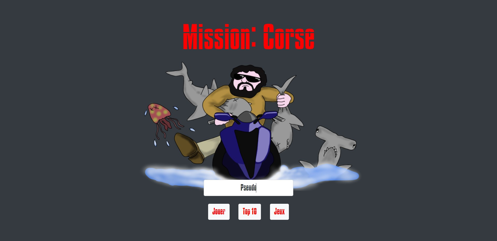

# Hakathon - thème : 'Les vacances d'été'

* ## Introduction
* ## Spécifications techniques
* ## Présentation des jeux
    * ## Mission:Corse
    * ## Breizh-Plage

## Introduction :

### Dans le cadre de ma formation, en fin d'année 2020, peu avant l'examen, nous avons pu, par groupe de 4, nous "évader" quelque peu par ce challenge visant à programmer ce que l'on voulait sur le thème des vacances d'été. Nous laissant un délai d'une semaine.

### Nous nous sommes rapidement entendu sur la programmation de 2 jeux mettant en scène les vacances de notre formateur, traitant ainsi le sujet avec humour.

### En plein préparatif des examens, nous nous sommes finalement retrouvé à 2 sur le projet, l'aute moitié de l'équipe trop en retard sur leur projet professionnel à présenté pour l'examen préférant se concentrer la dessus.

### Nous avons tout de même relevé le défi et avons eu le plaisir de le remporté ! :)

## Spécifications techniques :

### Nos jeux reposent sur l'utilisation de Javascript et principalement son canvas et la méthode setInterval(). L'utilisation du localStorage a permis de communiquer entre les pages pour stocker le pseudo, prévenir la fin du jeu et afficher en conséquence une modale pour un calcul dynamique des scores et définir si le score de la partie intègre ou non le top10.

### Bootstrap nous a permis de gagner du temps pour styliser nos page, compte tenu du délai court du challenge et de notre effectif réduit.

## Présentation des jeux :
* ## Mission:Corse :
### Notre formateur étant corse et fan des missions impossibles, nous avons implémenté un jeu consistant à traverser la mer en jet-ski pour rejoindre la Corse en 45 secondes sur fond de générique de la musique célèbre des films de la franchise. 

### Les touches directionnelles permettant de récupérer des drapeaux Corse ou d'échapper aux requins et méduses. La touche espace permettant de tirer sur ces derniers.
